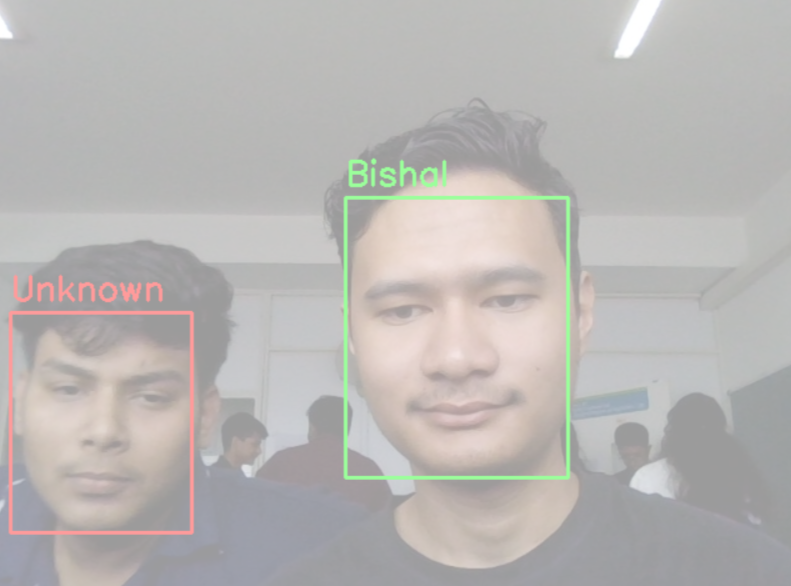

# Custom CNN Model (Core) and_Dataset for live face detection

This project contains a custom excel dataset taken from my own mobile categorizing myself and rest of people which is fed to a custom CNN deep neural network to recognize. This trained CNN model is then used to detect my face in realtime.

# Dataset Format for PyTorch Training
CSV-based dataset: Faces are saved as .jpg files and then pixel data is flattened and stored in a .csv (faces.csv), where each row represents one image.

Format: Each row contains the label (0 for "unknown", 1 for "bishal") and a space-separated string of greyscale pixel values, reshaped to 54x40 (height × width).

# Creating a Custom Labeled Dataset
Collection: Images are stored in folders (bishal, unknown) and each image of size 40 x 54 px.

Labeling: Code assigns labels by checking keywords in the filenames ("bishal", "unknown").

Processing: Images are converted to greyscale. Pixel values are flattened and appended with the label. Data is optionally saved to a CSV for convenient loading.

# Train a CNN to Recognize Your Face

Model Architecture:
CNN with Two convolutional layers (Conv2d), followed by pooling, Fully connected layers, Output through a sigmoid activation for binary classification (your face vs. others).

Data Loader: PyTorch Dataset to load and preprocess images from your CSV, converting them to tensors and normalizing (/255.0).

# Training process:
The code splits data into train and test sets, builds DataLoaders, and trains the model using binary cross-entropy loss. The displayed tensors during training confirm that your data pipeline works and data normalization is applied.

# Running Camera and Detect Your Face in Real Time

Capture: Use OpenCV: cv2.VideoCapture(0) to open the webcam.

Detection For each frame: Detect faces with a Haar cascade, DNN, or another face detector. Extract and resize the detected face to the input size expected by the CNN (54x40). Convert to greyscale (if not already), normalize, and turn into a tensor. Pass the tensor through your trained CNN. If output > 0.75, classify as "bishal"; else "unknown"

# Output
(output_preview/output_sample.png)

